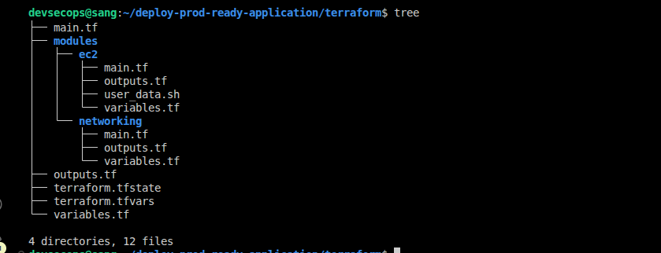
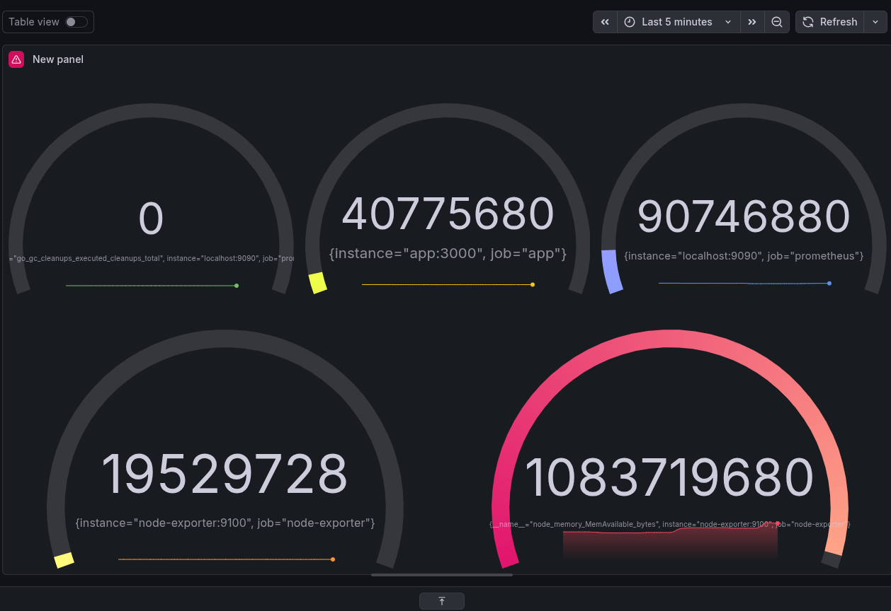
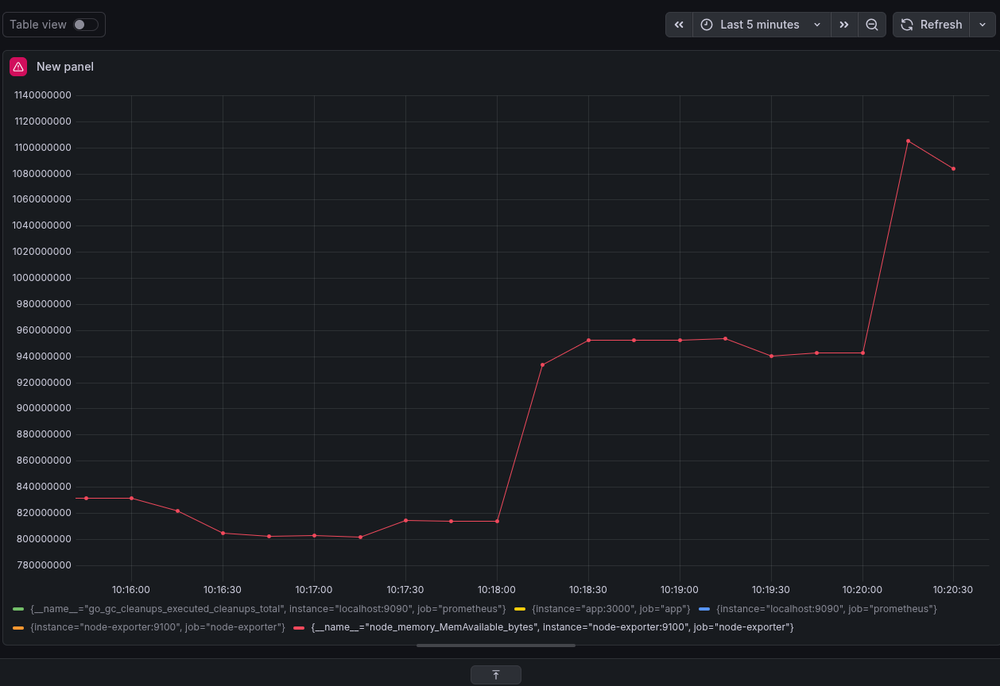
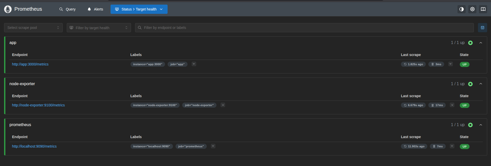
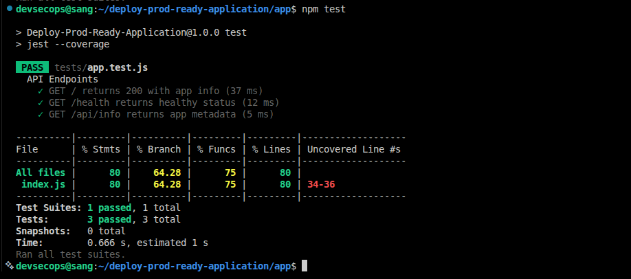

# Production-Ready Application Deployment

**DevOps Engineer Assessment Project**  
Automated deployment of a containerized Node.js microservice on AWS EC2 using Terraform and GitHub Actions.

---

## Architecture Flow & Overview

**.svg)**

### Infrastructure Components

- **Application**: Node.js Express microservice
- **Containerization**: Docker
- **Cloud Provider**: AWS (eu-west-2)
- **Compute**: EC2 t3.small instance
- **Networking**: VPC with public subnet, Internet Gateway, Security Group
- **CI/CD**: GitHub Actions
- **Container Registry**: Docker Hub
- **Monitoring**: AWS CloudWatch

---

## Design Decisions

### Why EC2 over ECS/EKS?
- **Simplicity**: Direct control over deployment process
- **Cost-effective**: Single instance suitable for demo workload
- **Learning value**: Full control over container orchestration
- **Quick iteration**: Faster debugging during development

### Terraform Modular Structure
****
- terraform/
- main.tf >>> # Root module
- outputs.tf              >>> # Infrastructure outputs
- variables.tf            >>> # Input variables
- modules/
  - networking/         >>> # VPC, subnet, IGW, routes
  - ec2/                >>> # Instance, security group, key pair

**Why modular?**
- Reusability across environments (dev/staging/prod)
- Easier testing and maintenance
- Clear separation of concerns

### CI/CD Pipeline Jobs
Job 1: Test
- Checkout code
- Setup Node.js 18
- Install dependencies (npm ci)
- Run Jest tests with coverage

Job 2: Build & Push (only if tests is successful)
- Login to Docker Hub
- Build Docker image
- Tag: latest + commit SHA
- Push to Docker Hub

Job 3: Deploy (only if build succeeds)
- SSH into EC2
- Pull latest image
- Stop old container
- Start new container 

**Why GitHub Actions?**
- Native GitHub integration
- No additional infrastructure needed
- Version-controlled YAML configuration
- Faster setup for this assessment
- Better for code review visibility

### Security Considerations
- SSH key pair managed via Terraform
- Secrets are stored in GitHub Actions (not committed)
- Security group restricts inbound traffic:
  - Port 22 (SSH) - your IP only
  - Port 80 (HTTP) - public access
- Docker Hub credentials are never exposed in logs

---

## Deployment Steps

### Prerequisites
- AWS account with IAM user credentials
- Terraform installed (>= 1.5.0)
- Docker Hub account
- GitHub repository

### 1. Clone Repository
```bash
git clone https://github.com/officialsangdavid/deploy-prod-ready-application.git
cd deploy-prod-ready-application
```

### 2. Configure AWS Credentials

This is to authenticate the user to their AWS account for Terraform to provision infrastructure. These credentials will also be added to the GitHub secrets for authentication.
```bash
aws configure
# Enter AWS_ACCESS_KEY_ID
# Enter AWS_SECRET_ACCESS_KEY
# Region: eu-west-2
```

### 3. Generate SSH Key Pair

The Key pair will be used for remote access to the Instance. The public key will be added for terraform to provision the EC2 Instance.
```bash
ssh-keygen -t ed25519 -f ~/.ssh/devops-challenge
# Public key will be used by Terraform
# Private key stays local (never committed)
```

### 4. Terraform Provisioning

Download all modules using "*terraform init*", review all infrastructure requirements for correctness with "*terraform plan*", then provision infrastructure with "*terraform apply*" 
```bash
cd terraform
terraform init
terraform plan
terraform apply
```

**Expected outputs:**

These outputs after terraform provisions all infrastructure will be added to the GitHub Secrets for effective deployments.
- EC2 public IP
- Instance ID
- SSH command

### 5: Install Docker on EC2
```bash
ssh -i ~/.ssh/devops-challenge ubuntu@http://35.178.42.66/health
curl -fsSL https://get.docker.com -o get-docker.sh
sudo sh get-docker.sh
sudo usermod -aG docker ubuntu

# Verify installation
docker --version 
```

### 6. Configure GitHub Secrets
Navigate to: **GitHub → Settings → Secrets and variables → Actions**

Add these secrets:
| Secret | Value |
|--------|-------|
| `AWS_ACCESS_KEY_ID` | AWS access key |
| `AWS_SECRET_ACCESS_KEY` | AWS secret key |
| `DOCKERHUB_USERNAME` | Docker Hub username |
| `DOCKERHUB_TOKEN` | Docker Hub access token |
| `EC2_HOST` | EC2 public IP (from Terraform output) |
| `EC2_SSH_KEY` | Contents of `~/.ssh/devops-challenge-key` (private key) |

### 7. Trigger Deployment
```bash
git add .
git commit -m "commit message"
git push origin main
```

GitHub Actions will automatically:
- Run tests
- Build Docker image
- Push to Docker Hub
- Deploy to EC2

### 8. Verify Deployment
```bash
# Check application is running
curl http://http://35.178.42.66/health

# Expected response:
{
  "status": "healthy",
  "timestamp": "2026-05-08T...",
  "version": "1.0.0"
}
```

---

## Monitoring & Logging

This project uses a dual monitoring approach: **AWS CloudWatch** for infrastructure-level 
metrics and **Prometheus + Grafana** for application-level observability.

---

### 1. AWS CloudWatch (Infrastructure Metrics)

AWS CloudWatch automatically tracks EC2-level health:

**CPU Utilization Alarm**  


- **Metric**: CPUUtilization > 70%
- **Period**: 5 minutes
- **Purpose**: Alert on high CPU usage

**Status Check Alarm**  


- **Metric**: StatusCheckFailed_Instance
- **Period**: 1 minute
- **Purpose**: Detect EC2 instance failures

---

### 2. Prometheus + Grafana (Application Metrics)

A full observability stack runs as Docker containers alongside the application.

| Component | Port | Role |
|---|---|---|
| Prometheus | 9090 | Scrapes and stores metrics |
| Grafana | 3001 | Visualises metrics via dashboards |
| Node Exporter | 9100 | Exposes host-level metrics to Prometheus |

**Metrics collected:**

- **CPU usage** — via Node Exporter host metrics
- **Memory usage** — container and host memory consumption
- **Process uptime** — application availability over time
- **Application availability** — `/health` endpoint monitored via Grafana

**Grafana Dashboard**  



Access Grafana at `http://<EC2_IP>:3001` (credentials: `admin` / `devops2024`)

**Prometheus Targets**  


Access Prometheus at `http://<EC2_IP>:9090`

**Dashboard setup:**
1. Login to Grafana → Connections → Data Sources → Add Prometheus
2. Set URL to `http://prometheus:9090` → Save & Test
3. Dashboards → Import → ID `1860` → Load → select Prometheus source → Import

---

### 3. Application Health Endpoint

The app exposes a `/health` endpoint polled by Grafana for availability monitoring:

```bash
curl http://<EC2_IP>/health

# Expected response:
{
  "status": "healthy",
  "timestamp": "2026-05-08T...",
  "version": "1.0.0"
}
```

---

### 4. Application Logs

Docker container logs are accessible via SSH:

```bash
ssh -i ~/.ssh/devops-challenge ubuntu@<EC2_IP>

# View app logs
docker logs app

# Follow logs in real time
docker logs -f app

# View all containers
docker compose -f /opt/deploy-prod-ready-application/docker-compose.yml ps
```


---

## Application Testing

### Local Testing
```bash
cd app
npm install
npm test
```

**Coverage Report:**  
****

### CI Testing
Tests run automatically on every push:
- All endpoints tested (/, /health, /api/info)
- Coverage threshold: 80%

---

## Technologies Used

| Component | Technology | Version |
|-----------|-----------|---------|
| Infrastructure | Terraform | 1.5.0 |
| Cloud Provider | AWS | eu-west-2 |
| Compute | EC2 | t3.small |
| Containerization | Docker | 24.x |
| CI/CD | GitHub Actions | - |
| Container Registry | Docker Hub | - |
| Application | Node.js + Express | 18.x |
| Testing | Jest + Supertest | 29.x |
| Monitoring | AWS CloudWatch | - |

---

## Assumptions

1. **Single-region deployment**: Application runs in `eu-west-2` only
2. **No database**: Stateless microservice (no persistent storage)
3. **HTTP only**: No SSL/TLS (production would use HTTPS + ALB)
4. **Single instance**: No auto-scaling or load balancing
5. **Basic security**: Security group allows SSH from anywhere (production: use bastion host)
6. **GitHub Actions**: Used instead of Jenkins for simplicity
7. **Docker Hub**: Public registry (production: use ECR)

---

## Limitations & Future Improvements

### Current Limitations
- **No HTTPS**: Application serves HTTP only
- **No auto-scaling**: Single EC2 instance (no redundancy)
- **No database**: Stateless application only
- **Basic logging**: No centralized log aggregation (ELK, CloudWatch Logs)
- **Manual secret management**: Secrets in GitHub (production: use AWS Secrets Manager)
- **No blue-green deployment**: Downtime during updates

### Recommended Improvements
- [ ] **HTTPS with Certificate Manager**: SSL/TLS encryption
- [ ] **Application Load Balancer**: Better traffic management
- [ ] **Auto Scaling Group**: Handle traffic spikes
- [ ] **RDS Database**: Persistent storage layer
- [ ] **CloudWatch Log Groups**: Centralized logging
- [ ] **AWS Secrets Manager**: Secure secret rotation
- [ ] **Multi-AZ deployment**: High availability
- [ ] **CloudFront CDN**: Global content delivery
- [ ] **Route 53 DNS**: Custom domain management
- [ ] **Terraform remote state**: S3 + DynamoDB locking
- [ ] **CI/CD improvements**: Staging environment, rollback strategy
- [ ] **Container scanning**: Trivy/Snyk in pipeline

#### Nice-to-Have
- [ ] **ECS/EKS migration**: Better container orchestration
- [ ] **Infrastructure testing**: Terratest
- [ ] **Prometheus + Grafana**: Advanced metrics
- [ ] **WAF**: Web application firewall
- [ ] **Backup strategy**: Automated snapshots

---

## Project Screenshots

### 1. Terraform Apply Success
****

### 2. GitHub Actions Pipeline Success
****

### 3. Docker Hub Image
****

### 4. Application Running on EC2
****

### 5. CloudWatch Dashboard
****

### 6. Health Check Response
****

### 6. Application Logs
****

### 7. Terraform Init
****

### 8. Terraform Validate
****

### 9. EC2 Instance
****

### 10. Test Coverage
****

### 11.Staus Check for Monitoring
****

### 12. Application Architecture
**.svg)**

### 13. Prometheus targets
****

### 14. Grafana Dashboards
****
---

## Contact

**Engineer**: Sang David  
**GitHub**: [GitHub](https://github.com/officialsangdavid)
**GitLab**: [Gitlab](https://gitlab.com/officialsangdavid)  
**Blog**: [Hashnode](https://hashnode.com/@sang)

---

## License

This project is for assessment purposes.
